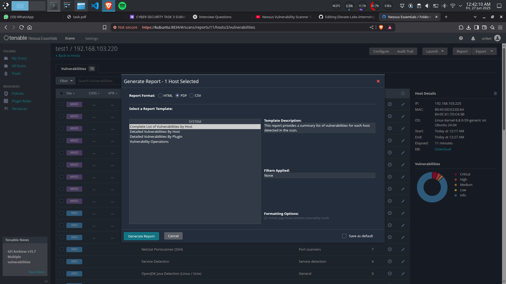

Elevate Labs Internship D03

Task 03 : Perform a Basic Vulnerability Scan on Your PC.

Objective: Use free tools to identify common vulnerabilities on your computer.  
Tools: OpenVAS Community Edition (free vulnerability scanner) or Nessus Essentials.  
Deliverables: Vulnerability scan report with identified issues.

Install Nessus Vulnerability Scanner from the <a href="https://www.tenable.com/products/nessus/nessus-essentials">official site</a>

Select the version and Host and download the Nessus application

Install the applicaion
for linux, command to install
<i>sudo dpkg -i Nessus-10.8.4-ubuntu1604_i386.deb</i>

Start Nessus
<i>sudo systemctl start nessusd</i>

Login to Nessus and wait for the plugins to get downloaded and compiled

Start a new scan

Save the report

